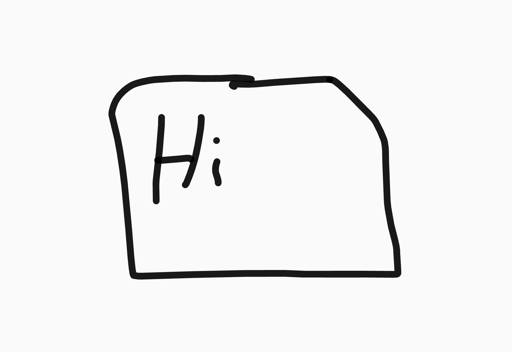

# Food-web

Interactive Food web

# How to use:

Clone it: gh repo clone ervin-code/Food-web
run it via driect html

Organism system (style.css)
: 

.Organism {
  position: absolute;
  border-radius: 50%;
  background-color: transparent;
  border: 2px solid #3498db;
  width: 50px;
  height: 50px;
}

(index.HTML)

 # 
  # 

This is a test

